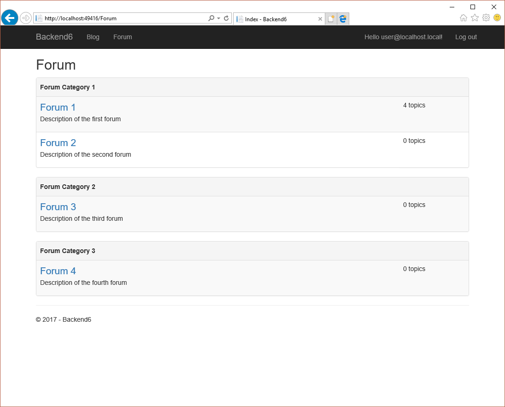

# Практика №6

## Темы

1. Работа с пользователями и контроль доступа.
2. Работа с файлами

## Задачи

1. Ознакомиться с заготовленным проектом
2. В заготовленном проекте, параллельно с уже реализованным прототипом блога, реализовать прототип форумов.
   1. Создать классы, реализующие модель предметной области в Entity Framework Core.
   2. Добавить миграции для данных классов.
   3. Реализовать контроллеры для CRUD-а объектов классов.
   4. Реализовать представления по приложенным макетам.
   5. Реализовать следующие ограничения доступа:
      1. Анонимный пользователь может только просматривать список форумов, тем и сообщений.
      2. Категории форумов и сами форумы могут создавать/редактировать/удалять только администраторы.
      3. Создавать темы и сообщения может любой аутентифицированный пользователь.
      4. Редактировать и удалять темы могут только автор темы и администраторы.
      5. Редактировать и удалять сообщения, а также добавлять и удалять из них файлы могут только автор сообщения и администраторы.

  
*Рис 1. Модель предметной области - блог*

  
*Рис 2. Модель предметной области - форум*

## Результат

  
*Рис 3. Список форумов - анонимный пользователь*

  
*Рис 4. Список форумов - обычный пользователь*

  
*Рис 5. Список форумов - администратор*

  
*Рис 6. Темы форума - анонимный пользователь*

  
*Рис 7. Темы форума - обычный пользователь*

  
*Рис 8. Тема - анонимный пользователь*

  
*Рис 9. Тема - обычный пользователь*

  
*Рис 10. Тема - администратор*

## Материалы

### Identity

ASP.NET Core имеет стандартную подсистему пользователей, которая называется `Identity` и предоставляет классы модели данных и набор служб, позволяющих добавить поддержку пользователей на сайт.

### Пользователь как объект системы

Пользователь представлен классом `ApplicationUser`, который, в свою очередь, наследуется от класса `IdentityUser`, предоставляемого пакетом `Identity`. Класс `ApplicationUser` специфичен для веб приложения и может быть, при необходимости, расширен.

Класс `ApplicationUser` включается по умолчанию в контекст Entity Framework и может быть связан с другими сущностями сайта.

### Инициализация пользователей и ролей

В случае если на сайте присутствуют привилегированные пользователи (например, администраторы), то необходимо обеспечить механизм их безопасного "появления" на сайте (так как им нельзя просто предоставить возможность зарегистрироваться самостоятельно). Один из способов это сделать - определить встроенную учетную запись администратора, которая автоматически создается вместе с сайтом и которая позволяет управлять остальными пользователями.

В классе `DbMigration` добавим метод `private async Task ConfigureIdentity(IServiceScope scope)`, который будет отвечать за инициализацию ролей и начальных пользователей сайта со следующей реализацией:

```csharp
private async Task ConfigureIdentity(IServiceScope scope)
{
    var roleManager = scope.ServiceProvider.GetService<RoleManager<IdentityRole>>();
    var userManager = scope.ServiceProvider.GetService<UserManager<ApplicationUser>>();

    var adminsRole = await roleManager.FindByNameAsync(ApplicationRoles.Administrators);
    if (adminsRole == null)
    {
        var roleResult = await roleManager.CreateAsync(new IdentityRole(ApplicationRoles.Administrators));
        if (!roleResult.Succeeded)
        {
            throw new InvalidOperationException($"Unable to create {ApplicationRoles.Administrators} role.");
        }

        adminsRole = await roleManager.FindByNameAsync(ApplicationRoles.Administrators);
    }

    var adminUser = await userManager.FindByNameAsync("admin@localhost.local");
    if (adminUser == null)
    {
        var userResult = await userManager.CreateAsync(new ApplicationUser
        {
            UserName = "admin@localhost.local",
            Email = "admin@localhost.local"
        }, "AdminPass123!");
        if (!userResult.Succeeded)
        {
            throw new InvalidOperationException($"Unable to create admin@localhost.local user");
        }

        adminUser = await userManager.FindByNameAsync("admin@localhost.local");
    }

    if (!await userManager.IsInRoleAsync(adminUser, adminsRole.Name))
    {
        await userManager.AddToRoleAsync(adminUser, adminsRole.Name);
    }
}
```

* Метод `roleManager.FindByNameAsync` выполняет поиск роли по ее имени и возвращает либо объект класса `IdentityRole`, либо `null`, если такой роли не существует.
* Метод `roleManager.CreateAsync` создает роль.
* Метод `userManager.FindByNameAsync` выполняет поиск пользователя по его имени и возвращает либо объект класса `ApplicationUser`, либо `null`, если такого пользователя не существует. 
* Метод `userManager.CreateAsync` создает пользователя.
* Метод `userManager.IsInRoleAsync` проверяет, имеет ли указанный пользователь указанную роль.
* Метод `userManager.AddToRoleAsync` добавляет указанному пользоваетлю указанную роль.

В результате, при каждом запуске сайта будет выполняться проверка и при необходимости создание роли `Administrators` и пользователя `admin@localhost.local` с паролем по умолчанию `AdminPass123!`. Для этого автоматически будет вызываться `private async Task ConfigureIdentity(IServiceScope scope)`, описанный ранее. Вызов буде тпроисходить в `Program.cs`.

### Получение информации о текущем пользователе

Для получения информации о текущем пользователе можно использовать службу `UserManager<ApplicationUser>` (которую можно подключить через dependency injection):

```csharp
var user = await this.userManager.GetUserAsync(this.HttpContext.User);
```

Убедиться, что пользователь аутентифицирован можно несколькими способами:

1. С помощью атрибута `[Authorize]`, который можно примерить к контроллеру, либо к его методу.
2. С помощью выражения `User.Identity.IsAuthenticated`, где `User` - свойство типа `ClaimsPrincipal`, доступное в контроллере, представлении, а также в `HttpContext`.

Убедиться, что пользователь имеет ту или иную роль (например, `Role1`) можно несколькими способами:

1. С помощью атрибута `[Authorize(Roles = "Role1")]`
2. С помощью выражения `User.IsInRole("Role1")`

При обращении к методу, явно помеченному атрибутом `[Authorize]`, либо методу, расположенному в контроллере, который помечен атрибутом `[Authorize]` процедура контроля доступа пройдет автоматически:

1. Если пользователь не аутентифицирован, то он будет перенаправлен на страницу аутентификации.
2. Если пользователь аутентифицирован, но не имеет необходимой роли - он получит уведомление об отказе в доступе.

В случае если контроллер помечен атрибутом `[Authorize]`, то этот атрибут можно "проигнорировать" в конкретных методах, если пометить их атрибутом `[AllowAnonymous]`.

### Проверка доступа на основании связи пользователя с объектом системы

Для более сложной проверки доступа, например проверки того, что пост может редактировать либо его автор, либо администратор, создадим службу:

```csharp
public interface IUserPermissionsService
{
    Boolean CanEditPost(Post post);

    Boolean CanEditPostComment(PostComment postComment);
}
```

Которую реализуем следующим образом:

```csharp
public class UserPermissionsService : IUserPermissionsService
{
    private readonly IHttpContextAccessor httpContextAccessor;
    private readonly UserManager<ApplicationUser> userManager;

    public UserPermissionsService(IHttpContextAccessor httpContextAccessor, UserManager<ApplicationUser> userManager)
    {
        this.userManager = userManager;
        this.httpContextAccessor = httpContextAccessor;
    }

    private HttpContext HttpContext => this.httpContextAccessor.HttpContext;

    public Boolean CanEditPost(Post post)
    {
        if (!this.HttpContext.User.Identity.IsAuthenticated)
        {
            return false;
        }

        if (this.HttpContext.User.IsInRole(ApplicationRoles.Administrators))
        {
            return true;
        }

        return this.userManager.GetUserId(this.httpContextAccessor.HttpContext.User) == post.CreatorId;
    }

    public Boolean CanEditPostComment(PostComment postComment)
    {
        if (!this.HttpContext.User.Identity.IsAuthenticated)
        {
            return false;
        }

        if (this.HttpContext.User.IsInRole(ApplicationRoles.Administrators))
        {
            return true;
        }

        return this.userManager.GetUserId(this.httpContextAccessor.HttpContext.User) == postComment.CreatorId;
    }
}
```

В данном случае проверка осуществляется следующим образом:
1. Если пользователь не аутентифицирован - доступ запрещен
2. Иначе, если пользователь - администратор - доступ разрешен
3. Иначе, доступ разрешен, если идентификатор пользователя совпадает с идентификатором создателя объекта.

### Работа с файлами

Получить файл через model binding можно путем объявления в модели представления свойства типа `IFormFile`.

При получении файла необходимо обязательно убедиться, что тип файла является допустимым (в противном случае, возможность загрузки произвольных файлов поставит безопасность сайта под угрозу) - например является изображение (которые можно сохранять относительно безопасно).

Получить имя файла можно следующим блоком кода:

```csharp
var fileName = Path.GetFileName(ContentDispositionHeaderValue.Parse(model.File.ContentDisposition).FileName.Trim('"'));
```

Определить тип можно через расширение файла, так как именно через расширение будет определяться способ его интерпретации севером:

```csharp
var fileExt = Path.GetExtension(fileName);
```

Хранить файлы можно в одной из подпапок папки `wwwroot` (так как содержимое этой папки отдается как статичное содержимое). Итоговый путь (например при сохранении в `wwwroot/attachments` можно рассчитать следующим образом):

```csharp
var attachmentPath = Path.Combine(this.hostingEnvironment.WebRootPath, "attachments", postAttachment.Id.ToString("N") + fileExt);
```

А рассчитать адрес, по которому необходимо подгружать файл с сервера можно следующим образом:

```csharp
postAttachment.Path = $"/attachments/{postAttachment.Id:N}{fileExt}";
```

Для того, чтобы выполнить само сохранение файла по указанному пути, можно создать `FileStream` и пользовать метод `CopyToAsync` интерфейса `IFormFile`:

```csharp
using (var fileStream = new FileStream(attachmentPath, FileMode.CreateNew, FileAccess.ReadWrite, FileShare.Read))
{
    await model.File.CopyToAsync(fileStream);
}
```

Отображение же файла (в данном случае, изображения) на странице можно реализовать следующим образом:

```html

```

Чтобы удалить файл (например, при удалении сущности, его описывающей), можно использовать следующий метод:

```csharp
System.IO.File.Delete(attachmentPath);
```